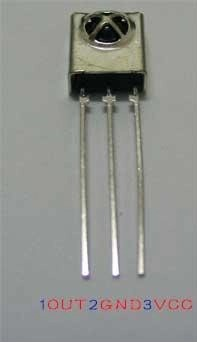
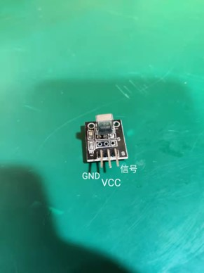
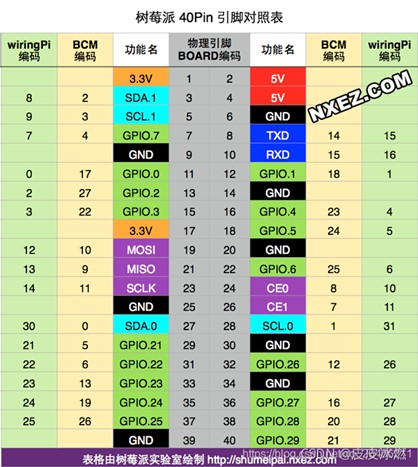
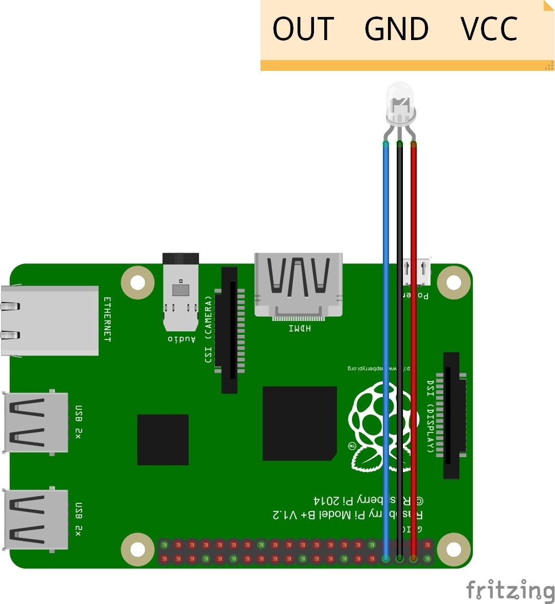

# 树莓派红外遥控

## 连线
HX1838引脚定义如下



HX1838模块引脚定义如下



GND连GND, VCC连5V, 在示例程序中信号管脚连接在BCM编码14上,如下图



在树莓派上保存并运行以下Python程序

```
#!/usr/bin/python
# -*- coding:utf-8 -*-  HX1838
import RPi.GPIO as GPIO
import time

PIN = 14;

GPIO.setmode(GPIO.BCM)
GPIO.setup(PIN,GPIO.IN,GPIO.PUD_UP)
print("等待中，请按下遥控器按钮...")

def ir_1838():
    ir_key=""
    if GPIO.input(PIN) == 0:
        count = 0
        while GPIO.input(PIN) == 0 and count < 200:
            count += 1
            time.sleep(0.00006)
        count = 0

        while GPIO.input(PIN) == 1 and count < 80:
            count += 1
            time.sleep(0.00006)
        
        idx = 0
        cnt = 0
        data = [0,0,0,0]
        for i in range(0,32):
            count = 0
            while GPIO.input(PIN) == 0 and count < 15:
                count += 1
                time.sleep(0.00006)

            count = 0
            while GPIO.input(PIN) == 1 and count < 40:
                count += 1
                time.sleep(0.00006)

            if count > 8:
                data[idx] |= 1<<cnt
            if cnt == 7:
                cnt = 0
                idx += 1
            else:
                cnt += 1

        if data[0]+data[1] == 0xFF and data[2]+data[3] == 0xFF:
            #print("Get the key: 0x%02x" %data[2])
            if  (data[2]==0x45):
                ir_key="1"
            elif(data[2]==0x46):
                ir_key="2"
            elif(data[2]==0x47):
                ir_key="3"
            elif(data[2]==0x44):
                ir_key="4"
            elif(data[2]==0x40):
                ir_key="5"
            elif(data[2]==0x43):
                ir_key="6"
            elif(data[2]==0x07):
                ir_key="7"
            elif(data[2]==0x15):
                ir_key="8"
            elif(data[2]==0x09):
                ir_key="9"
            elif(data[2]==0x16):
                ir_key="*"
            elif(data[2]==0x19):
                ir_key="0"
            elif(data[2]==0x0d):
                ir_key="#"
            elif(data[2]==0x18):
                ir_key="上"
            elif(data[2]==0x52):
                ir_key="下"
            elif(data[2]==0x08):
                ir_key="左"
            elif(data[2]==0x5a):
                ir_key="右"
            elif(data[2]==0x1c):
                ir_key="OK"
            #print("检测到按键：  "+ir_key)
    return ir_key


try:
    while True:
        
        ir_key=ir_1838()
        if ir_key != "":
            print("检测到遥控按键:  "+ir_key)
        time.sleep(0.01)
except KeyboardInterrupt:
GPIO.cleanup();
```

观察到有正确返回结果

